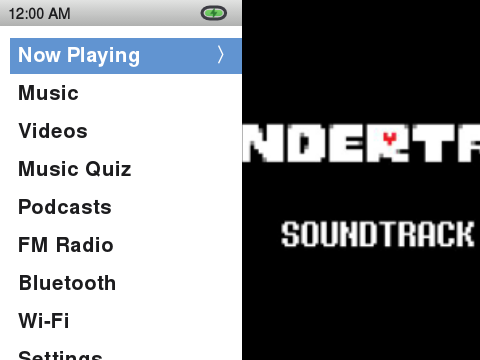
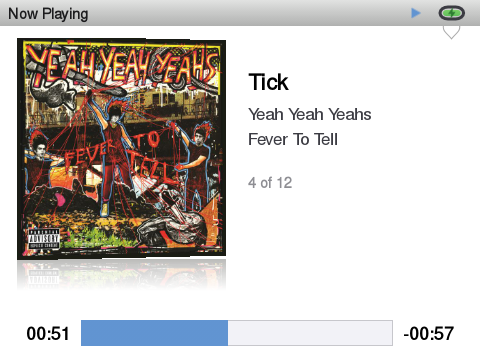
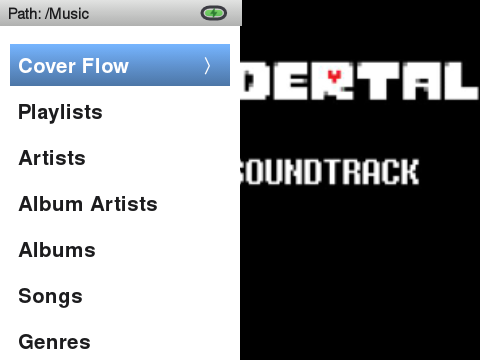
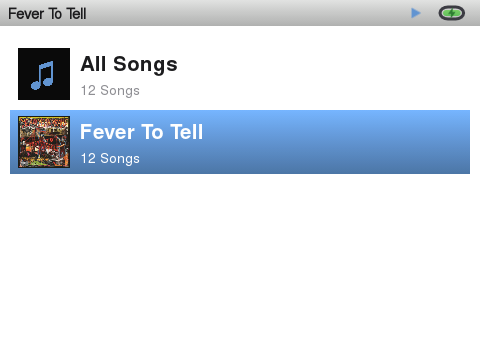

# InniClassic

<p align="center">
  
  
  
  
</p>

**InniClassic** is a launcher for the **Innioasis Y1** built directly on top of and based on [ismileblue/y1_launcher](https://github.com/ismileblue/y1_launcher) (JJ Launcher / MO-ON Launcher) — all credit for the original launcher, media engine, and theme system goes to that project. The goal of InniClassic is to turn JJ Launcher into as close to the original **iPod Classic experience** as possible — a bundled iPod-style theme, Last.fm scrobbling, a Music Quiz mini-game, and broader format support — while keeping everything JJ Launcher already does well.

This is **not** a GitHub "Fork" in the technical sense (it's a separate repository), but it is built directly on top of JJ Launcher's source and stays close to upstream so future JJ Launcher releases can keep being merged in.

> [!WARNING]
> Currently only tested and available for the **Innioasis Y1**. The Method 1 ROM ships Y1 Firmware 3.1.2; the standalone APK (Method 2) has also been verified on device System Software version 2.1.9 — check your own firmware version before installing anything below.

---

## Screenshots

| Main Menu | Now Playing | Music |
|---|---|---|
|  |  |  |

| Cover Flow | Album View | Music Quiz |
|---|---|---|
|  |  |  |

---

## What's different from upstream JJ Launcher

Everything below was added/changed on top of JJ Launcher; anything not listed here (media scanner, EQ, Bluetooth pairing, Wi-Fi keyboard, web server upload, custom theme engine, etc.) still works exactly as in the original project — see [ismileblue/y1_launcher](https://github.com/ismileblue/y1_launcher) for that documentation.

- **Installable as a flashable ROM** — `InniClassic-<version>-rom.zip` flashes directly via the [Innioasis Updater](https://www.innioasis.com/pages/download), no ADB required. Bundles the latest Y1 Firmware with InniClassic pre-installed as the system launcher. The APK is still available separately for updating an existing JJ Launcher install.
- **Built-in "iPod Classic" theme** — a bundled, ready-to-use theme aiming for a 1:1 iPod Classic look, plus an **iPod Classic (Dark)** variant with the same layout in an inverted dark palette:
  - White (or black, in Dark), plain-text iPod-style menu lists (no icons, tight left margin, consistent bold system font)
  - Two-pane Main Menu and Music menu: menu list on the left, a slowly panning album cover on the right that fills the entire remaining screen edge-to-edge and extends up behind the status bar
  - The status bar shows the current screen's name (Music/Now Playing/Settings/etc.) instead of a clock, like the real iPod's title bar
  - Redesigned Now Playing screen: angled album cover with a reflection underneath (toggleable via a new **Album Cover Tilt** setting), centered track info, thick square progress bar
  - Redesigned Artists/Albums lists: icon-free artist rows, large-cover two-line album rows (bold name + song count), "All Songs" shortcut per artist
  - A real search screen (title/artist/album) reachable from the Music menu
  - iPod Classic is the true default theme on first launch (instead of upstream's stock dark theme)
- **Now Playing depth** — center-click cycles Progress → Seek → Shuffle & Repeat → Rating sub-menus exactly like a real iPod Classic (wheel scrubs the track, cycles shuffle/repeat, or sets a 1–5 star rating depending on the state; reverts to volume control otherwise), plus:
  - An **On-The-Go playlist** — the classic always-available instant playlist, one tap away from the new Now Playing hold-menu
  - A **Now Playing hold-menu** (long-press Center): Add to On-The-Go, Browse Album, Browse Artist, Cancel — matching the real iPod's menu, plus a Toggle Visualizer entry for this project's bonus spectrum/lyrics view
- **Music library depth**:
  - **Composers** grouping in the Music menu
  - **Artists** and **Album Artists** are now two separate entries — Artists groups by the literal track artist tag (so features/collaborations show up individually), Album Artists is the original grouped-by-album-artist view — matching real iPod Classic
  - **Fast-scroll letter jump** — spin the wheel quickly through any alphabetized list to jump straight to the next letter, with an on-screen letter overlay, like a real click wheel
  - Main Menu cleanup: Cover Flow, Audiobooks, Folders, Years, Recently Added, and My Favorites live in the Music menu, not cluttering the Main Menu, matching real iPod Classic's menu structure
- **Music Quiz** — a from-scratch recreation of the classic iPod Music Quiz game using your own library, styled in the original's 2000s "Fruitiger Aero" glossy look. Structured into 5 rounds of 8 questions each, with a round-complete checkpoint screen and a distinct victory screen for clearing all 5 rounds (bonus rounds and additional question types are planned but not built yet)
- **Last.fm scrobbling** — two independent mechanisms, like Rockbox:
  - A permanent local `.scrobbler.log` in the classic Audioscrobbler 1.1 format
  - Live scrobbling against the real Last.fm API (`auth.getMobileSession` / `track.updateNowPlaying` / `track.scrobble`), with a browser-based login flow (via the device's Wi-Fi web server) since typing a username/password with a click-wheel is painful
- **OGG Vorbis support** — playback and library scanning for `.ogg` files, including automatic detection of files that are actually Opus-encoded but saved with an `.ogg` extension (common with some ripping tools)
- **Bluetooth reliability fix** — some speakers failed to connect because `BLUETOOTH_PRIVILEGED`/`WRITE_SECURE_SETTINGS` are signature-level permissions that simply declaring them in the manifest doesn't grant; now self-granted via a root shell command at startup, alongside the existing AVRCP version fix
- Assorted library/UI fixes made along the way: duplicate song de-duplication, folder-cover-art fallback for albums without embedded art, album-artist grouping, forced 1:1 album art cropping, OOM hardening for large library scans, track titles no longer show their file extension when a file has no title tag, consistent menu font size across every screen, and the wheel no longer stays active (e.g. changing volume) while the screen is locked

## Installation

There are two ways to get InniClassic onto your Innioasis Y1. Method 1 is recommended for most people — it's a single flash and there's nothing else to install or uninstall afterward.

### Method 1: Innioasis Updater (recommended)

The ROM package installs the latest **Y1 Firmware 3.1.2** with **InniClassic** already baked in as the system launcher — no ADB, no manual uninstall step, nothing else to do afterward.

1. Download `InniClassic-<version>-rom.zip` from this repo's [Releases](../../releases) page.
2. Open the [Innioasis Updater](https://www.innioasis.com/pages/download), select that zip as a local firmware file, and follow the on-screen instructions.
3. Once it finishes and the device reboots, InniClassic is the active launcher — nothing further to install.

> [!WARNING]
> Flashing firmware always carries some risk. Make sure the device stays connected and powered throughout the flash, and don't interrupt it.

### Method 2: Install just the APK over an existing JJ Launcher setup

Use this if you already have JJ Launcher running (via the stock firmware or Method 1's ROM from an earlier version) and just want to update the app itself.

1. **Uninstall the existing launcher app first** — this step is required, not optional (see [why](#replacing-the-stock-jj-launcher-app) below):
   ```bash
   adb uninstall com.themoon.y1
   ```
   If that fails because it's baked into your firmware image as a system app, use this instead:
   ```bash
   adb shell pm uninstall --user 0 com.themoon.y1
   ```
2. Connect the device to your PC and download the latest `InniClassic-<version>.apk` from this repo's [Releases](../../releases) page.
3. Install it:
   ```bash
   adb install InniClassic-<version>.apk
   ```
4. (Optional, only if Bluetooth pairing ever asks for a permission you can't grant from the UI):
   ```bash
   adb shell pm grant com.themoon.y1 android.permission.WRITE_SECURE_SETTINGS
   ```

To enable Last.fm scrobbling, open **Settings → Last.fm** on the device and log in through the browser-based flow (the device shows a URL/QR you open on your phone or PC). To use a custom theme other than the bundled iPod Classic one, see JJ Launcher's original theme documentation.

### Replacing the stock JJ Launcher app

(This only applies to Method 2 — Method 1's ROM already ships with InniClassic pre-installed, so there's nothing to replace.)

Both InniClassic and the stock JJ Launcher use the same package name (`com.themoon.y1`), but InniClassic's release APKs are currently **debug-signed** (see [Building it yourself](#building-it-yourself) — there's no shared release keystore yet). Android refuses to install an APK over an existing app if the signing certificate doesn't match, so skipping the uninstall step above and just running `adb install -r` will fail with:

```
Failure [INSTALL_FAILED_UPDATE_INCOMPATIBLE: ... signatures do not match]
```
or on older Android versions:
```
INSTALL_PARSE_FAILED_INCONSISTENT_CERTIFICATES
```

That's why the uninstall step above always comes before installing — there's no way around it as long as InniClassic ships debug-signed builds.

**What you keep, what you lose:** uninstalling only clears the app's private settings (app-internal preferences like toggles and any saved Last.fm session — you'll need to log in again). Your **music library**, **themes** (`/storage/sdcard0/Y1_Themes`), and the **`.scrobbler.log`** all live on the SD card, outside the app's private storage, so they're untouched and picked up again automatically on first launch.

## Speeding up large library scans

InniClassic caches your scanned library to a plain JSON file at the SD card's root (`.y1_library_cache.json`); any file already listed there is skipped during the next scan instead of being re-tagged. If you have a large library (thousands of tracks) and add music on your PC, [`tools/build_library_cache.py`](tools/build_library_cache.py) pre-builds that same cache file on your PC — much faster than the device's CPU — so the next on-device scan is just a quick existence check instead of tagging everything from scratch.

Requires the card to be accessible as a normal drive (card reader or USB mass storage, not MTP) and `pip install mutagen`:

```bash
python3 tools/build_library_cache.py /path/to/sdcard
```

Run it any time after copying new music over, before putting the card back in the device.

## Building it yourself

Last.fm requires every client to use its own API credentials, so none are shipped in this repository. To build from source:

1. Register a free API account at [last.fm/api/account/create](https://www.last.fm/api/account/create).
2. Add these two lines to your own `local.properties` (already gitignored, never committed):
   ```properties
   lastfm.api.key=YOUR_KEY
   lastfm.api.secret=YOUR_SECRET
   ```
3. Build as usual (`./gradlew assembleDebug`). Without a key, the app still runs fine — scrobbling simply won't authenticate.

## Credits & License

- Based on [ismileblue/y1_launcher](https://github.com/ismileblue/y1_launcher) (JJ Launcher / MO-ON Launcher) — all credit for the original launcher, media engine, and theme system goes to the original author.
- The bundled iPod Classic theme's system font is [Nimbus Sans](https://en.wikipedia.org/wiki/Nimbus_Sans) (URW++), a free, metric-compatible alternative to Helvetica.
- Distributed under the same license as upstream — see [LICENSE](LICENSE) (free for personal/educational, non-commercial use).

See [CHANGELOG.md](CHANGELOG.md) for the full version history.
