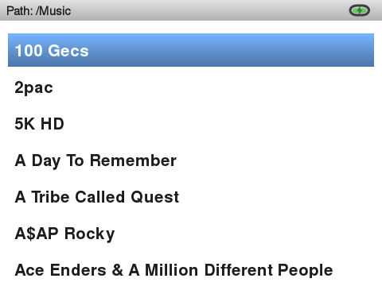

# InniClassic

<p align="center">
  
  
  
  
  <a href="https://buymeacoffee.com/gz17egcara"></a>
</p>

**InniClassic** is a launcher for the **Innioasis Y1** built directly on top of and based on [ismileblue/y1_launcher](https://github.com/ismileblue/y1_launcher) (JJ Launcher / MO-ON Launcher) — all credit for the original launcher, media engine, and theme system goes to that project. The goal of InniClassic is to turn JJ Launcher into as close to the original **iPod Classic experience** as possible, while going beyond it where it makes sense (FM Radio, Podcasts, Video, a from-scratch Music Quiz).

This is **not** a GitHub "Fork" in the technical sense (it's a separate repository), but it is built directly on top of JJ Launcher's source and stays close to upstream so future JJ Launcher releases can keep being merged in.

> [!WARNING]
> Currently only tested and available for the **Innioasis Y1**. The Method 1 ROM ships Y1 Firmware 3.1.2; the standalone APK (Method 2) has also been verified on device System Software version 2.1.9 — check your own firmware version before installing anything below.

---

## Screenshots

| Main Menu | Now Playing | Music |
|---|---|---|
|  |  |  |

| Artists | Album View | Cover Flow |
|---|---|---|
|  |  |  |

---

## Features

### The iPod Classic experience
- Bundled **iPod Classic** theme (light + dark variant), aiming for a 1:1 look: plain-text menu lists, real system-matched bold typography, tight iPod-accurate spacing, and a status bar that shows the current screen's name instead of a clock
- Two-pane Main Menu and Music menu, both sharing the exact same look and behavior: menu list on the left, a slowly panning ("Ken Burns") album cover on the right that bleeds all the way to the top of the screen, behind the status bar
- Redesigned **Now Playing** screen — large angled album cover with a reflection underneath (toggleable via **Album Cover Tilt**), a glass-look progress/volume bar, and a scrolling marquee for titles too long to fit
- Center-click on Now Playing cycles **Progress → Seek → Shuffle & Repeat → Rating**, exactly like a real iPod Classic (the wheel scrubs, cycles shuffle/repeat, or sets a star rating depending on the state; volume control otherwise)
- **On-The-Go playlist** and a **Now Playing hold-menu** (long-press Center): Add to On-The-Go, Rate Song, Browse Album, Browse Artist, Toggle Visualizer
- **Synced lyrics** — "Toggle Visualizer" swaps the spectrum analyzer for a scrolling, time-synced lyrics view whenever lyrics are found for the current track: an external `.lrc` file next to the song (same filename), or embedded lyrics (ID3 `USLT` for MP3, FLAC/ALAC tags) — synced if they contain `[mm:ss.xx]` timestamps, otherwise shown as plain scrolling text
- **Favorites** with a heart indicator on Now Playing (hollow when not favorited, filled red when it is)
- Fast-scroll letter jump on every alphabetized list, like spinning a real click wheel
- A from-scratch recreation of the classic **iPod Music Quiz** using your own library, 5 rounds of 8 questions with round-complete and victory screens

### Music library
- **Artists**, **Album Artists**, **Albums**, **Songs**, **Genres**, **Composers**, **Playlists**, **Favorites** — Artists groups by the literal track artist tag (so features/collaborations show up individually), Album Artists is the traditional grouped view
- Wide format support: MP3, FLAC, WAV, OGG Vorbis, Opus (including `.ogg`-extension Opus files), ALAC/M4A, AAC
- **Gapless playback** for albums and playlists of 15 tracks or fewer (see [Known limitations](#known-limitations))
- **Shuffle** row pinned to the top of All Songs, matching stock Y1 firmware
- Last.fm scrobbling — a local `.scrobbler.log` (Audioscrobbler 1.1 format) plus live scrobbling against the real Last.fm API, with a browser-based login flow since typing credentials with a click wheel is painful

### Beyond music
- **Podcasts** — subscribe, stream, download for offline listening
- **FM Radio** — talks to the real hardware tuner directly, no need for the stock radio app
- **Video playback** — a dedicated Videos folder on the SD card, full-screen playback with wheel-driven volume/seek, powered by libVLC for stable, correctly-synced playback (see [Known limitations](#known-limitations))
- **Audiobooks** — bookmarked, resumable playback
- **Wireless PC Upload** — a small web server for copying music onto the device over Wi-Fi, no cable needed

### Installable two ways
- **Flashable ROM** (`rom.zip`) via the [Innioasis Updater](https://www.innioasis.com/pages/download) — no ADB required
- Standalone **APK** for updating an existing install

### Under the hood
- A round of crash fixes for library browsing (Artists/Albums/Genres), FLAC playback, and the backlight timer not resetting during active use
- Debloated further — a number of never-used stock Android/MediaTek system apps (Exchange sync, live-wallpaper demos, SIM toolkit, text-to-speech, etc.) can be safely disabled to free up RAM and reduce background CPU/battery use
- Reduced background CPU wake-ups: the Now Playing progress ticker and the clock/widget refresh loop used to keep doing full work every 500ms–1s even when their screen wasn't visible (or the display was off) — both now sit idle unless actually needed

## Known limitations

- **Gapless playback** only activates for playlists of 15 tracks or fewer, with shuffle off and no FLAC files in the queue. FLAC decoding runs on a separate legacy engine that can't share ExoPlayer's native queue, and very large/shuffled queues (e.g. "All Songs") intentionally keep using the older, proven per-track loading path.
- **Video playback** now uses libVLC rather than ExoPlayer, after finding that ExoPlayer's precise frame-timing API doesn't exist before Android API 21, and its fallback for older devices is effectively broken on the Y1's API 17 (audio stayed in sync, but picture played back many times faster than real time). Playback is stable now; thumbnails in the video list and resume-position are still unaddressed. For smooth playback, keep source files modest — 640×480, 30fps, ~2 Mbps or less (see [`tools/handbrake_y1_preset.json`](tools/handbrake_y1_preset.json) for a ready-to-import HandBrake preset).

## Installation

There are two ways to get InniClassic onto your Innioasis Y1. Method 1 is recommended for most people — it's a single flash and there's nothing else to install or uninstall afterward.

### Method 1: Innioasis Updater (recommended)

The ROM package installs the latest **Y1 Firmware 3.1.2** with **InniClassic** already baked in as the system launcher — no ADB, no manual uninstall step, nothing else to do afterward.

1. Select inniclassic from the "Software" dropdown menu
2. Select the version you'd like to install
3. Click Install / Restore and follow the on screen instructions

> [!WARNING]
> Flashing firmware always carries some risk. Make sure the device stays connected and powered throughout the flash, and don't interrupt it.

### Method 2: Install just the APK over an existing JJ Launcher setup

Use this if you already have JJ Launcher running (via the stock firmware or Method 1's ROM from an earlier version) and just want to update the app itself.

1. **Uninstall the existing launcher app first** — this step is required, not optional (see [why](#replacing-the-stock-jj-launcher-app) below):
   ```bash
   adb uninstall com.themoon.y1
   ```
   If that fails because it's baked into your firmware image as a system app, use this instead:
   ```bash
   adb shell pm uninstall --user 0 com.themoon.y1
   ```
2. Connect the device to your PC and download the latest `InniClassic-<version>.apk` from this repo's [Releases](../../releases) page.
3. Install it:
   ```bash
   adb install InniClassic-<version>.apk
   ```
4. (Optional, only if Bluetooth pairing ever asks for a permission you can't grant from the UI):
   ```bash
   adb shell pm grant com.themoon.y1 android.permission.WRITE_SECURE_SETTINGS
   ```

To enable Last.fm scrobbling, open **Settings → Last.fm** on the device and log in through the browser-based flow (the device shows a URL/QR you open on your phone or PC). To use a custom theme other than the bundled iPod Classic one, see JJ Launcher's original theme documentation.

### Replacing the stock JJ Launcher app

(This only applies to Method 2 — Method 1's ROM already ships with InniClassic pre-installed, so there's nothing to replace.)

Both InniClassic and the stock JJ Launcher use the same package name (`com.themoon.y1`), but InniClassic's release APKs are currently **debug-signed** (see [Building it yourself](#building-it-yourself) — there's no shared release keystore yet). Android refuses to install an APK over an existing app if the signing certificate doesn't match, so skipping the uninstall step above and just running `adb install -r` will fail with:

```
Failure [INSTALL_FAILED_UPDATE_INCOMPATIBLE: ... signatures do not match]
```
or on older Android versions:
```
INSTALL_PARSE_FAILED_INCONSISTENT_CERTIFICATES
```

That's why the uninstall step above always comes before installing — there's no way around it as long as InniClassic ships debug-signed builds.

**What you keep, what you lose:** uninstalling only clears the app's private settings (app-internal preferences like toggles and any saved Last.fm session — you'll need to log in again). Your **music library**, **themes** (`/storage/sdcard0/Y1_Themes`), and the **`.scrobbler.log`** all live on the SD card, outside the app's private storage, so they're untouched and picked up again automatically on first launch.

## Speeding up large library scans

InniClassic caches your scanned library to a plain JSON file at the SD card's root (`.y1_library_cache.json`); any file already listed there is skipped during the next scan instead of being re-tagged. If you have a large library (thousands of tracks) and add music on your PC, [`tools/build_library_cache.py`](tools/build_library_cache.py) pre-builds that same cache file on your PC — much faster than the device's CPU — so the next on-device scan is just a quick existence check instead of tagging everything from scratch.

Requires the card to be accessible as a normal drive (card reader or USB mass storage, not MTP) and `pip install mutagen`:

```bash
python3 tools/build_library_cache.py /path/to/sdcard
```

Run it any time after copying new music over, before putting the card back in the device.

## Building it yourself

Last.fm requires every client to use its own API credentials, so none are shipped in this repository. To build from source:

1. Register a free API account at [last.fm/api/account/create](https://www.last.fm/api/account/create).
2. Add these two lines to your own `local.properties` (already gitignored, never committed):
   ```properties
   lastfm.api.key=YOUR_KEY
   lastfm.api.secret=YOUR_SECRET
   ```
3. Build as usual (`./gradlew assembleDebug`). Without a key, the app still runs fine — scrobbling simply won't authenticate.

## What's different from upstream JJ Launcher

For anyone tracking this project against [ismileblue/y1_launcher](https://github.com/ismileblue/y1_launcher): everything in [Features](#features) above was added or substantially changed on top of JJ Launcher. Anything not mentioned there (media scanner internals, EQ, Bluetooth pairing, Wi-Fi keyboard, the custom theme engine, etc.) still works as in the original project — see upstream's documentation for that.

## Credits & License

- Based on [ismileblue/y1_launcher](https://github.com/ismileblue/y1_launcher) (JJ Launcher / MO-ON Launcher) — all credit for the original launcher, media engine, and theme system goes to the original author.
- The bundled iPod Classic theme's system font is [Nimbus Sans](https://en.wikipedia.org/wiki/Nimbus_Sans) (URW++), a free, metric-compatible alternative to Helvetica.
- Distributed under the same license as upstream — see [LICENSE](LICENSE) (free for personal/educational, non-commercial use).

If InniClassic's useful to you, you can [buy me a coffee](https://buymeacoffee.com/gz17egcara) — totally optional, never required.

See [CHANGELOG.md](CHANGELOG.md) for the full version history.
